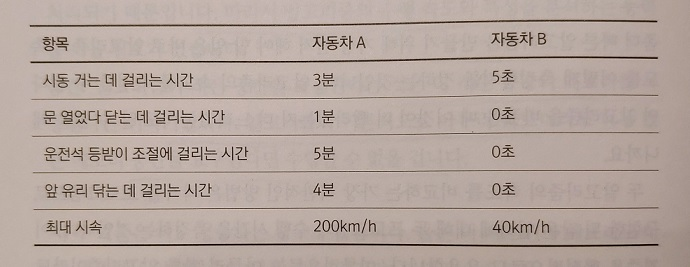
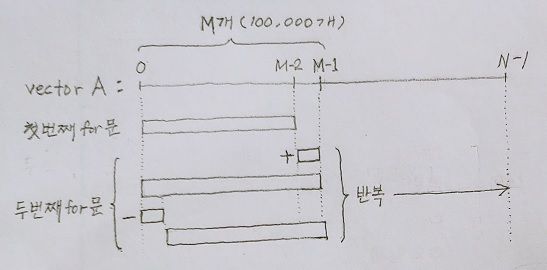
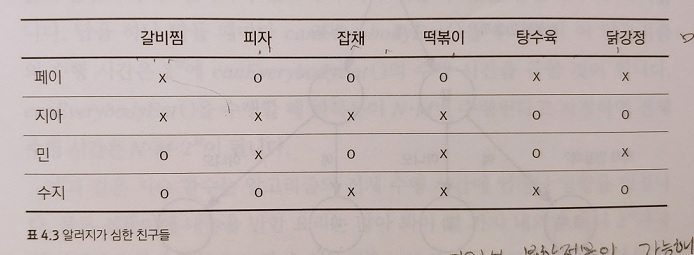
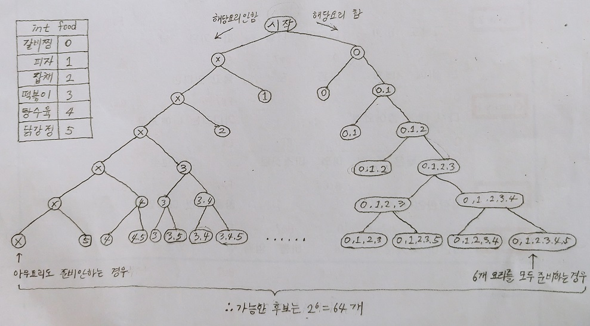
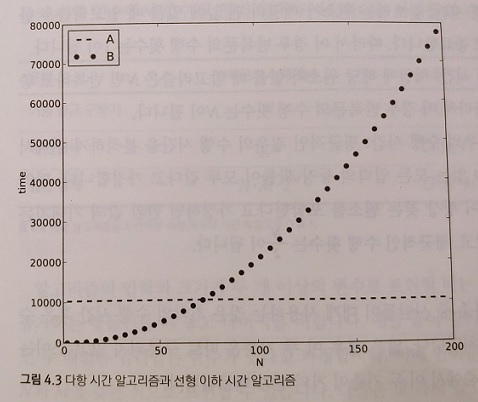
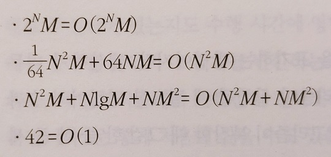
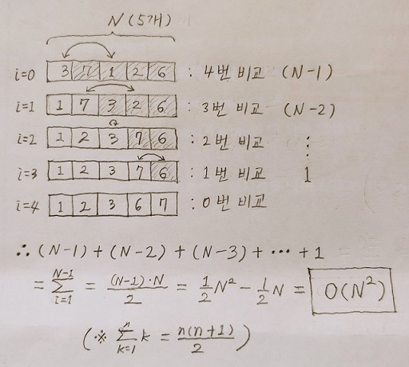
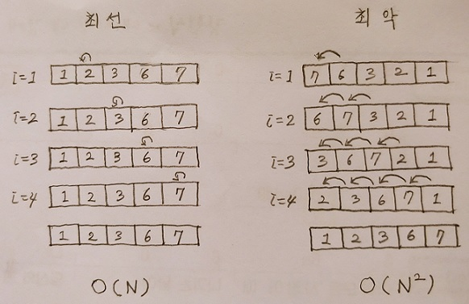
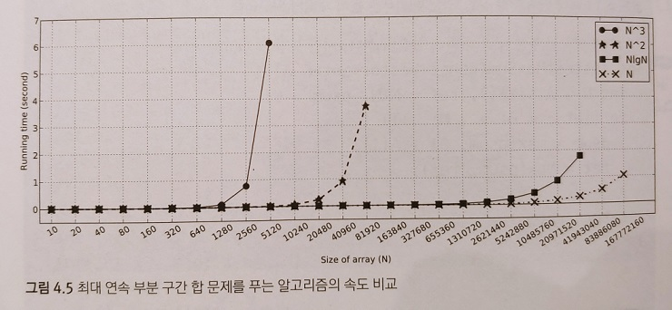
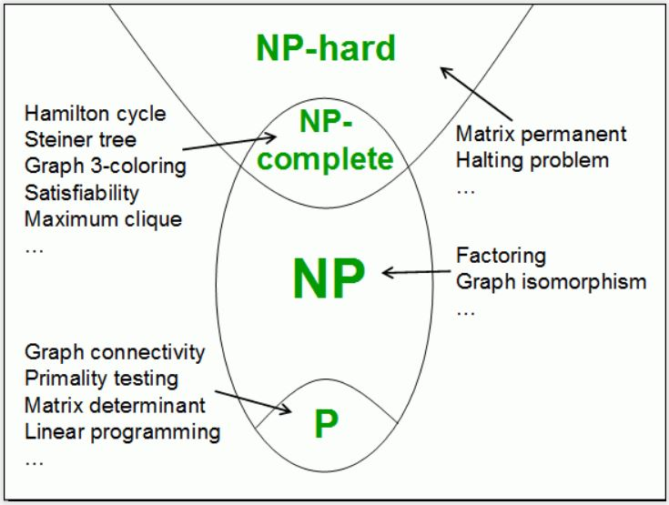

# 개관

- 알고리즘 : 어떤 작업이 주어졌을 때, 컴퓨터가 이 작업을 해결하는 방법
- 예제
  - N명이 프로그래밍 대회에 참가함
  - 100점이 만점일 때, 1등부터 20등까지의 점수의 평균을 구하는 방법?
  - 해결방법은 여러가지가 있습니다.
    1. 모든 사람의 점수를 내림차순 정렬, 20등까지만 남기고 나머지는 버림
    2. 20등까지만 기록가능한 기록표를 만들고, 거기다가 N명의 기록을 모두 훑으면서 삽입, 제거
    3. 임의의 한 명을 기준으로 삼은뒤, 더 잘한 그룹과 더 못한 그룹으로 나눔
       - 더 잘한 그룹이 20명 이상이라면 더 못한 그룹은 버림
       - 더 잘한 그룹이 20명 이하라면 그들은 상위 20위에 포함시키고 더 못한 그룹에서 반복
  - 이 예제의 3가지 해결방법은 모두 알고리즘이라고 할 수 있습니다.
- 그럼 알고리즘과 알고리즘이 아닌 것은 어떻게 구분할 수 있을까요?
- 예제
  - 신촌역에서 춘천까지 가는 방법
  - 알고리즘의 예 - 객관적이고 누구나 알 수 있는 방법
    1. 지하철 2호선을 타고 시청역으로 간다.
    2. 지하철 1호선으로 갈아타고 청량리역으로 간다.
    3. 경춘선을 타고, 춘천역에서 내린다.
  - 알고리즘이 아닌 예 - 주관적이고 모호한 방법
    1. 강동구 쪽으로 가는 버스를 탄다.
    2. 동서울 버스터미널 근처에 온 것 같으면 내린다.
    3. 춘천 쪽으로 가는 버스를 타고, 한참 가다 내린다.
- 이렇듯 알고리즘은 객관적이고 명료해야 합니다. 그래야만 소스코드로 구현할 수 있습니다.
- 그런데 이처럼 주어진 문제에 여러가지 알고리즘이 있을 때는 어떤걸 선택해야 할까요?
- 알고리즘 선택 기준
  - 시간 : 빠를수록 좋다.
  - 공간 : 적게 사용할수록 좋다.
- 시간과 공간은 서로 상충되는 경우가 많습니다. 즉, 공간을 더 많이 사용해서 시간을 개선하거나 그 반대입니다.
- 둘 다 중요하지만, 프로그래밍 대회에서 더 중요한 것은 **시간**입니다.

# 4장. 알고리즘의 시간 복잡도 분석

## 4.1 도입

- 빠른 알고리즘을 만들려면 우선 속도를 측정할 수 있어야 합니다.
- 가장 쉬운 방법은 직접 **실행시간을 측정**하는 것이긴 하지만 일반적인 관점에서 속도를 얘기할 때는 부적합
  - 이유 1 : 하드웨어, 운영체제, 컴파일러 등의 외부요인에 영향을 받기 때문에
  - 이유 2 : 처리하는 데이터의 양에 따라서 속도가 달라지기 때문에

### 반복문이 지배한다

* 예제 : 서울에서 부산까지 갈 때, 어느 쪽이 더 빠를까요?  
  
* 누구나 자동차 A 를 선택할 것입니다. 왜 그럴까요?
  * 시동거는데 3분이라는 긴 시간이 걸리지만, 서울에서 부산까지 가는데 큰 영향을 주는 인자가 아닙니다.
  * 또한, 나머지 인자들도 선택에 큰 영향을 주지 않습니다.
  * 결국 영향을 주는 인자는 **최대 시속**입니다.
  * 이처럼 대세를 결정하는 인자를 지배한다(dominate)라고 표현합니다.
  * 이동거리가 아주 짧으면 자동차 B가 더 빠를 수 있지만, 이동거리가 조금만 길어져도 자동차 A가 훨씬 빠릅니다.
* 그럼 알고리즘에서 대세를 결정하는 인자는 무엇일까요?
  * 바로 반복문입니다.
  * 자동차 예제의 이동거리는 곧 input data로 생각할 수 있습니다. input data가 크면 클수록 반복문이 대세를 결정합니다.
  * 문제 1 : 아래 알고리즘의 수행시간은 얼마일까요?  
    ```c++
    int majority1(const vector<int>& A) {
    	int N = A.size();
    	int majority = -1, majorityCount = 0;
    	
    	for(int i = 0; i < N; ++i) {
    		int V = A[i], count = 0;
    		for(int j = 0; j < N; ++j) {
    			if(A[j] == V) {
    				++count;
    			}
    		}
    	
    		if(count > majorityCount) {
    			majorityCount = count;
    			majority = V;
    		}
    	}
    }
    ```
    * 정답 : N^2  
      ※ N 크기의 반복문이 2개 겹쳐져 있으므로 N x N 입니다.
  * 문제 2 : 아래 알고리즘의 수행시간은 얼마일까요?  
    ```c++
    int majority2(const vector<int>& A) {
    	int N = A.size();
        vector<int> count(101, 0);
        for(int i = 0; i < N; ++i) {
            count[A[i]]++;
        }
        
        int majority = 0;
        for(int i = 1; i <= 100; ++i) {
            if(count[i] > count[majority]) {
    			majority = i;   
            }
        }
        return majority;
    }
    ```
    * 정답 : N  
      ※ 반복문 2개를 합쳐서 N + 100 이라고 생각할 수 있지만 N이 커질수록 100의 영향은 미비해지기 때문에 N이라고만 쓰게 됩니다.

## 4.2 선형 시간 알고리즘

### 다이어트 현황 파악: 이동 평균 계산하기

* 이동평균은 시간에 따라 변화하는 값들을 관찰할 때 유용한 방법입니다.
* M-이동평균 : 마지막 M개의 평균
* 아래 그림은 글쓴이의 1년간 다이어트 기록입니다. 별표는 3-이동평균을 의미합니다.  
  
* M-이동평균 첫번째 구현  
  ```c++
  vector<double> movingAverage1(const vector<double>& A, int M) {
  	vector<double> ret;
  	int N = A.size();
  	for(int i = M-1; i<N; ++i) {
  		double partialSum = 0;
  		for(int j = 0; j < M; ++j)
  			partialSum += A[i-j];
  		ret.push_back(partialSum / M);
  	}
  	return ret;
  }
  ```
  * 알고리즘 수행속도 분석
    * 첫번째 for문 : N - (M-1) = N - M + 1회
    * 두번째 for문 : M - 0 = M회  
      ※ 최대값(?) - 초기값
    * 수행속도 : (N - M + 1) x M = NM - M^2 + M
    * 따라서 다이어트 그래프의 3-이동평균을 구하는 반복문 수행횟수는 30입니다.  
      ※ (12x3) - (3x3) + 3 = 30 (N=12, M=3)
* 다만, 첫번째 구현은 그렇게 빠르지 않습니다.
  * 어떤 사람의 나이가 969세이고 (969 x 365 = 353,685일)
  * 매일매일 지난 100,000일의 이동평균을 알고 싶다면 어떻게 될까요? (한달이 아니라 하루의 변화임)
  * 첫번째 알고리즘으로는 253억 회를 수행해야 합니다. 이렇게 큰 데이터를 위해서는 개선이 필요합니다.
  * idea : 중복된 계산 없애기
    * 먼저 M-이동평균을 구하려면 데이터가 M개는 모여야 합니다.
    * 다음으로 바로 전날 구한 이동평균 데이터의 합에서 첫번째 값을 빼고 오늘 값을 더하면 오늘 필요한 이동평균 데이터의 합이 됩니다.
    * 왠지 반복문의 중첩을 없앨 수 있을 것 같습니다.  
      
* M-이동평균 개선
  ```c++
  vector<double> movingAverage2(const vector<double>& A, int M) {
      vector<double> ret;
      int N = A.size();
      double partialSum = 0;
      for(int i = 0; i < M-1; ++i)
          partialSum += A[i];
      for(int i = M-1; i < N; ++i) {
          partialSum += A[i];
          ret.push_back(partialSum / M);
          partialSum -= A[i-M+1];
      }
      return ret;
  }
  ```
  * 알고리즘 수행속도 분석
    * 첫번째 for문 : (M-1) - 0 = M - 1
    * 두번째 for문 : N - (M-1) = N - M + 1
    * 수행속도 : (M - 1) + (N - M + 1) = N
    * 개선된 알고리즘의 수행속도는 입력된 데이터의 크기와 동일합니다.  
      
* 위의 개선안과 같이 입력의 크기와 속도가 동일한 알고리즘을 선형시간 (linear time) 알고리즘이라고 합니다.
* 선형시간 알고리즘은 주어진 입력을 1번씩만 보면 되기 때문에 대부분의 경우에 좋은 알고리즘으로 판단할 수 있습니다.

## 4.3 선형시간보다 빠른 알고리즘

### 성형 전 사진 찾기

* 그럼 선형시간 알고리즘 보다 더 빠른 알고리즘이 있을까요?
* 예제
  * 아이돌 A군이 언제 성형했는지 궁금합니다.
  * A군의 사진 10만장을 시간순으로 정렬했습니다.
  * 해결방법
    * 가장 중간에 있는 5만번째 사진을 봅니다.
    * 성형을 했다면 결과가 나왔습니다.
    * 성형을 안했다면 이전에 찍은 사진 5만장은 볼 필요가 없습니다.
    * 이렇게 중간시점의 사진을 보는 방법을 반복합니다.
    * 그러면 17번 안에 성형여부를 확인할 수 있게 됩니다.  
      
* 위의 예제는 입력의 크기인 10만장을 다 보지도 않고 답을 구했습니다.
* 이것을 이전처럼 수학적으로 표현하면 어떻게 될까요?
  * 확인해야 할 데이터가 1/2씩 줄어들기 때문에 밑이 2인 로그를 사용하게 됩니다.
  * 밑이 2인 로그를 특별히 lg 라고 표현합니다.
  * 결국, 위 예제의 수행속도는 lgN 가 됩니다.
* 이렇게 선형시간보다 빠른 알고리즘을 선형 이하 시간(sublinear) 알고리즘이라고 부릅니다.

### 이진탐색

* 이처럼 탐색범위를 반씩 줄여가는 알고리즘은 이진탐색이라는 공식명칭이 있을 정도로 유명합니다.
* C++에서는 lower_bound() 와 upper_bound()라는 함수를 제공합니다.

### 그래도 선형 시간 아닌가요?

* C++에서 제공하는 함수를 사용하려면 2가지 추가작업이 필요해 보입니다. 그래서 결국 선형시간 아닌가요?
  * 정렬이 되어 있어야 한다.
  * A라는 배열에 {0, 0, 0, ....., 1, 1, 1} 과 같이 성형여부를 알 수 있는 정보가 이미 있어야 한다.
* 이러한 추가작업으로 이진탐색의 수행속도를 판단하는 것은 맞지 않습니다, 왜냐하면
  * 정렬은 한 번만 해놓으면 이진탐색을 수 없이 수행할 수 있기 때문에 분리해서 계산해야 합니다.
  * A라는 배열을 미리 만들어서 가지고 있지 않아도 됩니다. 직접 이진탐색을 구현한다면 찾아진 사진만 판단하면 되기 때문입니다. 즉, 성형했는지 확인하는 함수를 만들어서 17번만 호출하면 됩니다.

### 구현

* 이렇게 이진탐색은 아이디어가 간단하고 선형시간 보다도 빠릅니다.
* 다만, 구현이 상당히 까다로운 알고리즘 중에 하나입니다. (5.2절에서 확인)

## 4.4 지수 시간 알고리즘

### 다항 시간 알고리즘

* 현재까지 다룬 lgN, N, N^2 등과 같은 알고리즘을 다항 시간 알고리즘이라고 부릅니다.
* 그런데 lgN 과 N^100 은 속도차이가 엄청날텐데 왜 묶어서 표현할까요?
* 바로 다항시간보다 훨씬 느린 지수시간 알고리즘이 있기 때문입니다. 
* 지수시간 알고리즘은 여러 다항시간 알고리즘 간의 차이는 다른 차원으로 극적으로 느립니다.

### 알러지가 심한 친구들

* 예제
  * N명의 친구는 저마다 알러지 때문에 못 먹는 음식이 있습니다.
  * 관련 정보가 아래와 같을 때, 누구라도 하나의 음식은 먹을 수 있게 하려면 최소 몇 가지의 음식이 필요할까요?  
    

### 모든 답 후보를 평가하기

* idea
  * 음식 6개를 조합할 수 있는 경우의 수를 다 추출하기 : 2^6 = 64가지  
    ※ 각각의 음식은 "포함 된다" vs "안 된다" 라는 2가지 상태를 가짐
  *  추출된 각각의 경우에 대해 원하는 조건을 만족하는지 검사
* 6장에서 자세히 다루지만, 이렇게 모든 경우의 수를 탐색하는 가장 쉬운 방법은 재귀함수를 이용하는 것입니다.
* 코드는 아래와 같습니다.
  ```c++
  const int INF = 987654321;
  // 이 메뉴로 모두가 식사할 수 있는지 여부를 반환한다.
  bool canEverybodyEat(const vector<int>& menu);
  // 요리할 수 있는 음식의 종류 수
  int M;
  // food 번째 음식을 만들지 여부를 결정한다.
  int selectMenu(vector<int>& menu, int food) {
      // 기저 사례: 모든 음식에 대해 만들지 여부를 결정했을 떄
      if(food == M) {
          if(canEverybodyEat(menu)) return menu.size();
          // 아무것도 못 먹는 사람이 있으면 아주 큰 값을 반환한다.
          return INF;
      }
      // 이 음식을 만들지 않는 경우의 답을 계산한다.
      int ret = selectMenu(menu, food+1);
      // 이 음식을 만드는 경우의 답을 계산해서 더 작은 것을 취한다.
      menu.push_back(food);
      ret = min(ret, selectMenu(menu, food+1));
      menu.pop_back();
      return ret;
  }
  ```
  * 코드해석
    * 재귀함수를 통해 음식조합으로 가능한 모든 경우를 구함
    * 재귀함수가 기저사례가지 도달하면(위 트리의 리프노드) 모든 친구들의 알러지를 피해갈 수 있는지 확인
    * 확인결과 성공이면 포함된 메뉴의 개수를 저장 (더 적은 값으로)  
      

#### 지수 시간 알고리즘

* 알고리즘 수행속도 분석
  * 음식 M개로 만들수 있는 조합의 개수 : 2^M 개
  * 알러지를 피해갈 수 있는 확인하는 함수 canEverybodyEat()의 수행속도는 NM 으로 가정
  * 최종 수행속도 : N x M x 2^M
* 이렇게 2^M 과 같은 수행시간을 가지는 알고리즘을 지수시간 (exponential time) 알고리즘이라고 부릅니다.
* 지수시간 알고리즘은 입력데이터가 조금만 커져도 급속도로 수행시간이 늘어나는 매우 느린 알고리즘입니다.
* 그럼 개선할 수 있을까요?
  * 사실 위 문제는 set cover 라고 하는 유명한 알고리즘 문제 중 하나이며 개선방법은 아직 없습니다.
  * 11장에서 이러한 지수시간 알고리즘을 조금 빠르게 개선하는 방법을 소개하긴 하지만, 여전히 지수시간을 극복할 수는 없습니다.

### 소인수 분해의 수행 시간

* 지금까지는 입력 데이터의 개수에 따라 수행속도가 달라졌습니다. (입력 데이터가 많으면 느리고 적으면 빠르고)
* 그러나 항상 그런것은 아닙니다.
* 예제 : 소인수분해 코드
  ```c++
  vector<int> factor(int n) {
      if(n == 1) return vector<int>(1, 1);
      vector<int> ret;
      for(int dev = 2; n > 1; ++div) 
          while(n % div == 0) {
              n /= div;
              ret.push_back(div);
          }
      return ret;
  }
  ```
  * 위 코드의 내용보다도 입력값 보겠습니다.
  * 입력의 개수는 하나인데도 그 값의 크기에 따라서 수행속도가 달라집니다.
    * 지금까지는 입력의 개수에 따라 수행속도를 계산해왔기 때문에 이 부분이 약간 혼란이 올 수도 있습니다.  
      (표현방법이 애매할 수 있다는 뜻)
    * 쉽게 생각하면, int n 에 저장된 값에 따라 비트정보가 달라질테니 이것도 역시 입력의 크기에 따라 수행속도가 달라진다고 생각하면 편합니다.  
      ※ 같은 int n 안에서도 0000 , 0001 과 같이 비트단위로 데이터 크기가 달라지므로
  * 결론적으로 이런 코드에 대해서는 **입력의 크기에 대한 지수시간 알고리즘이다**라고 말하면 됩니다.

## 4.5 시간 복잡도

* 알고리즘의 수행시간을 측정하는 기준을 시간 복잡도(time complexity)라고 부릅니다.
* 시간복잡도는 사칙연산, 대입문 등 언어에서 제공하는 기본적인 연산 한줄한줄의 개수를 통해 계산합니다.
* **A의 시간복잡도가 B보다 높다** == A알고리즘이 더 느리다
  * 한 가지 주의할 점은
  * 입력데이터의 양이 적으면 시간복잡도가 높은 알고리즘의 수행속도가 더 빠를수도 있다는 점입니다.
  * 예제 : 두 알고리즘 A, B의 시간복잡도가 아래와 같다고 해봅시다.
    * 알고리즘 A : 10240 + (35 x lgN)
    * 알고리즘 B : 2N^2
    * 우리는 lgN 이 N 보다 빠르다는 것을 이미 배웠습니다. 
    * 그러나 아래 그래프와 같이 N 의 값이 충분히 작다면 알고리즘 B가 더 빠를 수 있습니다.  
      

### 입력의 종류에 따른 수행 시간의 변화

* 아쉽게도 입력의 크기가 수행 시간을 결정하는 유일한 척도는 아닙니다.
* 예제 : 아래 코드는 array에서 element를 찾는 코드입니다.
  ```c++
  int firstIndex(const vector<int>& array, int element) {
  	for(int i = 0; i < array.size(); ++i)
		if(array[i] == element)
  			return i;
  	return -1;
  } 
  ```
* 그런데 element의 위치에 따라서 매번 수행시간이 달라질 것입니다.
* 이런 경우에는 **최선**, **최악**, **평균** 수행시간을 모두 구하는 것입니다.
  * 최선 : 1번 - element가 arrray의 맨 앞에 있을 때
  * 최악 : N번 - element가 array의 맨 뒤에 있을 때
  * 평균 : N/2번
* 그리고 일반적으로 최악의 수행시간을 많이 사용하지만, 예외의 경우도 있을 수 있습니다.  
  ※ 예 : 퀵정렬

### 점근적 시간 표기: O (빅오) 표기

* 시간복잡도는 기본연산을 모두 계산해야 하기 때문에 빠르게 계산하기 어려울 때가 많습니다.
* 위의 예제들에서 대세에 영향을 주는 반복문만 고려했던 것이 기억나시나요?
* 이처럼 영향이 미비한 값들은 버리는 것이 점근적 시간표기입니다.
* 예를 들어
  * 시간복잡도가 3N^2 + 205N + 5235 인 알고리즘이 있다면 O(N^2) 이라고만 표기합니다.
* 다양한 예제가 아래에 있습니다.  
  
  * 3번째 : N^2M 과 NM^2 중에 어느것이 더 빠를지 예측할 수 없기 때문에 둘 다 포함
  * 4번째 : 이렇개 O(1) 로 표현되는 알고리즘을 상수시간(constant-time)알고리즘 이라고 부릅니다.
* 이제 간단하게 알고리즘의 복잡도를 표현하고 비교할 수 있습니다.

### O 표기법의 의미

* O 표기법이 어떤 알고리즘의 최악의 수행시간을 의미하지는 않습니다.
* 예를 들어, 퀵정렬의 최악 수행시간은 O(N^2) 이지만, 평균 수행시간은 O(NlgN) 이기 때문입니다. 

### 시간 복잡도 분석 연습

* 선택정렬 (selenction sort)
  ```c++
  void selectionSort(vector<int>& A) {
  	for(int i = 0; i < A.size(); ++i) {
  		int minIndex = i;
  		for(int j = i+1; j < A.size(); ++j)
  			if(A[minIndex] > A[j])
  				minIndex = j;
  		swap(A[i], A[minINdex]);
  	}
  }
  ```
  * 시간복잡도 분석 : 입력데이터에 종류에 관계없이 시간복잡도가 같음  
    
* 삽입 정렬 (insertion sort)
  ```c++
  void insertionSort(vector<int>& A) {
      for(int i = 0; i < A.size(); ++i) {
          int j = i;
          while(j > 0 && A[j-1] > A[j]) {
              swap(A[j-1], A[j]);
              --j;
          }
      }
  }
  ```
  * 시간복잡도 분석 : 입력데이터에 종류에 따라 시간복잡도가 변함  
    

## 4.6 수행 시간 어림짐작하기

### 주먹구구 법칙

* 시간복잡도를 가지고 코드의 실제 수행시간을 어림짐작 할 수 있어야 합니다.
* 프로그래밍 대회 참가자들이 사용하는 주먹구구 법칙
  * 시간복잡도를 구함
  * 입력크기를 대입해서 수행횟수를 구함
  * 1초당 반복문 수행 횟수가 1억(10^8)을 넘어가면 시간제한을 초과할 가능성 있음
* 예제 : 입력데이터 개수 = N = 10,000
  * O(N^3) = 1억을 훨씬 넘을것임
  * O(NlgN) = 1억이 훨씬 안될것임
  * O(N^2) = 10,000 x 10,000 = 딱 1억 
* 예제의 마지막 시간복잡도는 좀 애매할 수 있습니다. 이런 경우에는 주어진 환경에 따라 결과가 달라질 수 있습니다. 따라서 실패한다고 가정하고 더 개선하는게 좋습니다.
* 주먹구구 법칙을 적용할 때는 충분한 여유를 두기 바랍니다.

### 실제 적용해 보기

* 예제 : 1차원 배열에서 연속된 부분 구간 중, 그 합이 최대인 것 찾기
  
  * 만약, 배열이 [-7, 4, -3, 6, 3, -8, 3, 4] 라면 최대합 부분구간은 [4, -3, 6, 3] 입니다.
  
* 4가지의 서로 다른 알고리즘을 통해서 시간복잡도를 분석해 보겠습니다.

* 알고리즘 #1
  * 시간복잡도 : O(N^3)
    - 바깥의 for문 2개 : O(N^2)
    
    - 제일 안쪽 for문 : N/2 = O(N)  
    
      ※ 1번 + 2번 + 3번 + 4번 +  ... + N-2번 + N-1번 = N/2
  ```c++
  const int MIN = numeric_limits<int>::min();
  
  int ineffcientMaxSum(const vector<int>& A) {
  	int N = A.size(), ret = MIN;
  	for(int i = 0; i < N; ++i)
  		for(int j = 0; j< N; ++j) {
  			int sum = 0;
  			for(int k = i; k <= j; ++k)
  				sum += A[k];
  			ret = max(ret, sum);
  		}
  	return ret;
  }
  ```
  
* 알고리즘 #2
  - 개선내용 : 이동평균에서 합을 구했던 방법을 응용해서 맨 안쪽 for문을 없앰
  - 시간복잡도 : O(N^2)
  ```c++
  int betterMaxSum(const vector<int>& A) {
  	int N = A.size(), ret = MIN;
  	for(int i = 0; i < N; ++i) {
  		int sum = 0;
  		for(int j = i; j < N; ++j) {
  			sum += A[j];
  			ret = max(ret, sum);
  		}
  	}
  	return ret;
  }
  ```
  
* 알고리즘 #3
  - 개선내용 : 분할정복 기법 사용 (7장 분할정복에서 확인)
  - 시간복잡도 : O(NlgN)
  ```c++
  int fastMaxSum(const vector<int>& A, int lo, int hi) {
  	if(lo == hi) return A[lo];
  	int mid = (lo + hi) / 2;
  	int left = MIN, right = MIN, sum = 0;
  	for(int i = mid; i >= lo; --i) {
  		sum += A[i];
  		left = max(left, sum);
  	}
  	sum = 0;
  	for(int j = mid+1; j <= hi; ++j) {
  		sum += A[j];
  		right = max(right, sum);
  	}
  	
  	int single = max(fastMaxSum(A, lo, mid), fastMaxSum(A, mid+1, hi));
  	return max(left + right, single);
  }
  ```
  
* 알고리즘 #4
  * 개선내용 : 점화식 사용 (8장 동적계획법에서 확인)
  * 시간복잡도 : O(N)
  ```c++
  int fasestMaxSum(const vector<int>& A) {
  	int N = A.size(), ret = MIN, psum = 0;
  	for(int i = 0; i < N; ++i) {
  		psum = max(psum, 0) + A[i];
  		ret = max(psum, ret);
  	}
  	return ret;
  }
  ```
  
* 이렇게 시간복잡도가 서로 다른 4개의 알고리즘을 구현했습니다.
  * O(N^3)
  * O(N^2)
  * O(NlogN)
  * O(N)

* 만약, 문제와 함께 주어진 시간제한이 1초라면 4개의 알고리즘 중 어떤 것이 성공할까요?
  
  ※ 시간제한이 1초면 주먹구구 법칙으로 1억이 기준선
  
  * N = 1,000 일 떄
    * O(N^3) = 10억 : 주먹구구 법칙으로 실패할 확률이 크지만 반복문 내부가 단순하므로 될 수도 있음
    * O(N^2), O(NlogN), O(N)  : 무난하게 성공
  * N = 10,000 일 때
    * O(N^3) = 1조 : 무조건 실패
    * O(N^2) = 1억 : 주먹구구 법칙으로 보면 성공이나 실패를 예측 어려움, 반복문 내부가 단순하므로 될 수도 있음
    * O(NlogN) O(N) : 무난하게 성공
  * N = 100,000 일 때
    * O(N^3) = 무조건 실패
    * O(N^2) = 100억 : 실패할 확률이 큼
    * O(NlgN) = 2천만 : 성공할 확률이 큼
    * O(N) : 무난하게 성공
  
* 이렇듯 어떤 문제에 대한 알고리즘을 구현한 후에 주먹구구 법칙을 통해 성공이나 실패를 가늠해 볼 수 있습니다.
* 만약, 주어진 조건에서 실패할 확률이 크다면 좀 더 개선하는 작업이 필요하게 됩니다.
* 이제 실제 측정치를 확인해 보겠습니다.  
  ※ 입력데이터가 커질수록 복잡도가 높은 알고리즘은 급격히 느려집니다.  
  

## 4.7 계산 복잡도 클래스 : P, NP, NP-완비

* 계산 복잡도 이론 : 어떤 문제를 풀기위한 알고리즘을 분류하고 그 특성을 연구하는 학문

### 문제의 특성

* 계산 복잡도 이론에서 쉬운 문제란?
  * 문제의 난이도에 상관없이 빠른 알고리즘이 있다고 증명되면 쉬운 문제입니다.
* 계산 복잡도 이론에서 빠르다의 의미?
  * 다항 시간 알고리즘이 존재하는 문제를 의미합니다.
  * 이들을 **P**문제(polynomial)라고 부릅니다.
  * 삽입정렬, 선택정렬 등이 P문제에 속합니다.
  * 이렇게 분류된 문제들은 P문제 계산 복잡도 클래스(complexity class)에 속했다고 합니다.

### 난이도의 함정

* NP문제(non-deterministic polynomial)도 있습니다. 
* 재밌는 점은 NP문제라고 P문제의 반대를 의미하지 않습니다.
* 아직 다항 시간 알고리즘을 못 찾은 문제들일뿐... 다항 시간 알고리즘이 없다고도 증명되지 않았습니다.
* 없음을 증명하기가 더 어렵다고 합니다.  
  ※ 예를 들어, UFO가 존재함을 증명하려면 UFO를 하나만 찾으면 되지만, 존재하지 않음을 증명하려면 우주를 다 확인해야 증명이 됩니다.

### NP문제, NP-hard 문제

* NP문제  
  * 다항시간 알고리즘은 모르지만, 정답인지를 확인하는 다항 시간 알고리즘은 존재하는 집합입니다.
  * 지수시간 알고리즘만 존재하지만 상황에 따라 다항시간에 완료되기도 합니다.
* P == NP ?  
  * 수학계 7대 난제
  * NP문제가 P문제라고 밝혀지면 세상에 존재하는 많은 문제를 빠르게 풀 수 있게 됩니다.
* 환산(reduction)기법
  * A문제의 풀이 방법을 B문제의 풀이방법으로 바꾸는 것입니다.  
    예) 덧셈은 곱셈으로 바꿔서 계산할 수 있습니다.
  * 이 때, 덧셈은 곱셈으로 환산가능(reducible)하다고 표현합니다
* NP-hard 문제
  * 모든 NP문제들이 A라는 문제로 환산가능(reducible)하다면, 문제 A는 NP-hard에 속하게 됩니다.
  * 즉, A라는 문제는 모든 NP문제보다 어렵습니다.
* NP-complete 문제
  * NP-hard이면서 NP인 문제입니다.
  * NP-complete 문제가 중요한 이유?  
    : NP-complete 중 하나라도 다항시간 알고리즘을 찾으면 모든 NP문제가 P문제라는 것이 증명됩니다  
    
