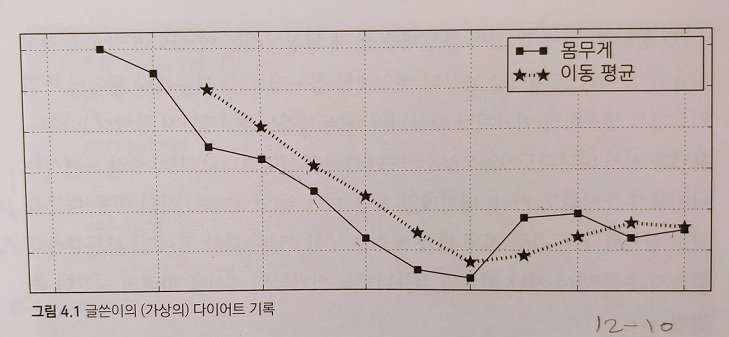

# 개관

- 알고리즘 : 어떤 작업이 주어졌을 때, 컴퓨터가 이 작업을 해결하는 방법
- 예제
  - N명이 프로그래밍 대회에 참가함
  - 100점이 만점일 때, 1등부터 20등까지의 점수의 평균을 구하는 방법?
  - 해결방법은 여러가지가 있습니다.
    1. 모든 사람의 점수를 내림차순 정렬, 20등까지만 남기고 나머지는 버림
    2. 20등까지만 기록가능한 기록표를 만들고, 거기다가 N명의 기록을 모두 훑으면서 삽입, 제거
    3. 임의의 한 명을 기준으로 삼은뒤, 더 잘한 그룹과 더 못한 그룹으로 나눔
       - 더 잘한 그룹이 20명 이상이라면 더 못한 그룹은 버림
       - 더 잘한 그룹이 20명 이하라면 그들은 상위 20위에 포함시키고 더 못한 그룹에서 반복
  - 이 예제의 3가지 해결방법은 모두 알고리즘이라고 할 수 있습니다.
- 그럼 알고리즘과 알고리즘이 아닌 것은 어떻게 구분할 수 있을까요?
- 예제
  - 신촌역에서 춘천까지 가는 방법
  - 알고리즘의 예 - 객관적이고 누구나 알 수 있는 방법
    1. 지하철 2호선을 타고 시청역으로 간다.
    2. 지하철 1호선으로 갈아타고 청량리역으로 간다.
    3. 경춘선을 타고, 춘천역에서 내린다.
  - 알고리즘이 아닌 예 - 주관적이고 모호한 방법
    1. 강동구 쪽으로 가는 버스를 탄다.
    2. 동서울 버스터미널 근처에 온 것 같으면 내린다.
    3. 춘천 쪽으로 가는 버스를 타고, 한참 가다 내린다.
- 이렇듯 알고리즘은 객관적이고 명료해야 합니다. 그래야만 소스코드로 구현할 수 있습니다.
- 그런데 이처럼 주어진 문제에 여러가지 알고리즘이 있을 때는 어떤걸 선택해야 할까요?
- 알고리즘 선택 기준
  - 시간 : 빠를수록 좋다.
  - 공간 : 적게 사용할수록 좋다.
- 시간과 공간은 서로 상충되는 경우가 많습니다. 즉, 공간을 더 많이 사용해서 시간을 개선하거나 그 반대입니다.
- 둘 다 중요하지만, 프로그래밍 대회에서 더 중요한 것은 **시간**입니다.

# 4장. 알고리즘의 시간 복잡도 분석

## 4.1 도입

- 빠른 알고리즘을 만들려면 우선 속도를 측정할 수 있어야 합니다.
- 가장 쉬운 방법은 직접 **실행시간을 측정**하는 것이긴 하지만 일반적인 관점에서 속도를 얘기할 때는 부적합
  - 이유 1 : 하드웨어, 운영체제, 컴파일러 등의 외부요인에 영향을 받기 때문에
  - 이유 2 : 처리하는 데이터의 양에 따라서 속도가 달라지기 때문에

### 반복문이 지배한다

* 예제 : 서울에서 부산까지 갈 때, 어느 쪽이 더 빠를까요?

  

* 누구나 자동차 A 를 선택할 것입니다. 왜 그럴까요?

  * 시동거는데 3분이라는 긴 시간이 걸리지만, 서울에서 부산까지 가는데 큰 영향을 주는 인자가 아닙니다.
  * 또한, 나머지 인자들도 선택에 큰 영향을 주지 않습니다.
  * 결국 영향을 주는 인자는 **최대 시속**입니다.
  * 이처럼 대세를 결정하는 인자를 지배한다(dominate)라고 표현합니다.
  * 이동거리가 아주 짧으면 자동차 B가 더 빠를 수 있지만, 이동거리가 조금만 길어져도 자동차 A가 훨씬 빠릅니다.

* 그럼 알고리즘에서 대세를 결정하는 인자는 무엇일까요?

  * 바로 반복문입니다.

  * 자동차 예제의 이동거리는 곧 input data로 생각할 수 있습니다. input data가 크면 클수록 반복문이 대세를 결정합니다.

  * 문제 1 : 아래 알고리즘의 수행시간은 얼마일까요?

    ```c++
    int majority1(const vector<int>& A) {
    	int N = A.size();
    	int majority = -1, majorityCount = 0;
    	
    	for(int i = 0; i < N; ++i) {
    		int V = A[i], count = 0;
    		for(int j = 0; j < N; ++j) {
    			if(A[j] == V) {
    				++count;
    			}
    		}
    	
    		if(count > majorityCount) {
    			majorityCount = count;
    			majority = V;
    		}
    	}
    }
    ```

    * 정답 : N^2

      ※ N 크기의 반복문이 2개 겹쳐져 있으므로 N x N 입니다.

  * 문제 2 : 아래 알고리즘의 수행시간은 얼마일까요?

    ```c++
    int majority2(const vector<int>& A) {
    	int N = A.size();
        vector<int> count(101, 0);
        for(int i = 0; i < N; ++i) {
            count[A[i]]++;
        }
        
        int majority = 0;
        for(int i = 1; i <= 100; ++i) {
            if(count[i] > count[majority]) {
    			majority = i;   
            }
        }
        return majority;
    }
    ```

    * 정답 : N

      ※ 반복문 2개를 합쳐서 N + 100 이라고 생각할 수 있지만 N이 커질수록 100의 영향은 미비해지기 때문에 N이라고만 쓰게 됩니다.

## 4.2 선형 시간 알고리즘

### 다이어트 현황 파악: 이동 평균 계산하기

* 이동평균은 시간에 따라 변화하는 값들을 관찰할 때 유용한 방법입니다.

* M-이동평균 : 마지막 M개의 평균

* 아래 그림은 글쓴이의 1년간 다이어트 기록입니다. 별표는 3-이동평균을 의미합니다.

  

* M-이동평균 첫번째 구현

  ```c++
  vector<double> movingAverage1(const vector<double>& A, int M) {
  	vector<double> ret;
  	int N = A.size();
  	for(int i = M-1; i<N; ++i) {
  		double partialSum = 0;
  		for(int j = 0; j < M; ++j)
  			partialSum += A[i-j];
  		ret.push_back(partialSum / M);
  	}
  	return ret;
  }
  ```

  * 알고리즘 수행속도 분석

    * 첫번째 for문 : N - (M-1) = N - M + 1회

    * 두번째 for문 : M - 0 = M회

      ※ 최대값(?) - 초기값

    * 수행속도 : (N - M + 1) x M = NM - M^2 + M

    * 따라서 다이어트 그래프의 3-이동평균을 구하는 반복문 수행횟수는 30입니다.

      ※ (12x3) - (3x3) + 3 = 30 (N=12, M=3)

* 첫번째 구현은 빠르지 않습니다.

  * 어떤 사람의 나이가 969세이고 
  * 매일매일 지난 10만일의 이동평균을 알고 싶다면 어떻게 해야할까요? (한달이 아니라 하루)
  * 위 알고리즘으로는 253억 회가 됩니다. 이렇게 큰 데이터를 위해서 개선이 필요합니다.
  * idea
    * 중복된 계산 없애기
    * 먼저, M-이동평균을 구하려면 데이터가 M개는 모여야 합니다.
    * 다음으로, 바로 전날 구한 이동평균 데이터의 합에서 첫번째 값을 빼고 오늘 값을 더하면 오늘 필요한 이동평균 데이터의 합이 됩니다.
    * 즉, 반복문의 중첩을 없앨 수 있을 것 같습니다.

* M-이동평균 개선

  ```c++
  vector<double> movingAverage2(const vector<double>& A, int M) {
      vector<double> ret;
      int N = A.size();
      double partialSum = 0;
      for(int i = 0; i < M-1; ++i)
          partialSum += A[i];
      for(int i = M-1; i < M; ++i) {
          partialSum += A[i];
          ret.push_back(partialSum / M);
          partialSum -= A[i-M+1];
      }
      return ret;
  }
  ```

  


