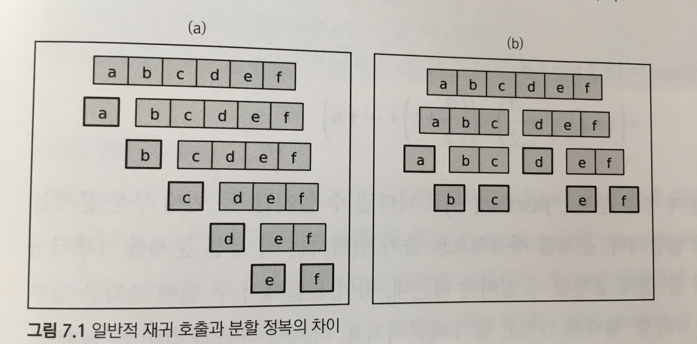
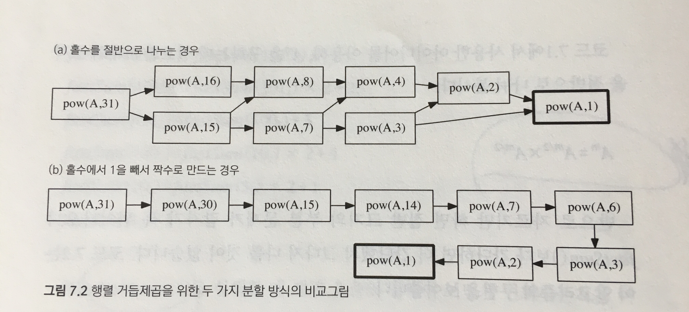
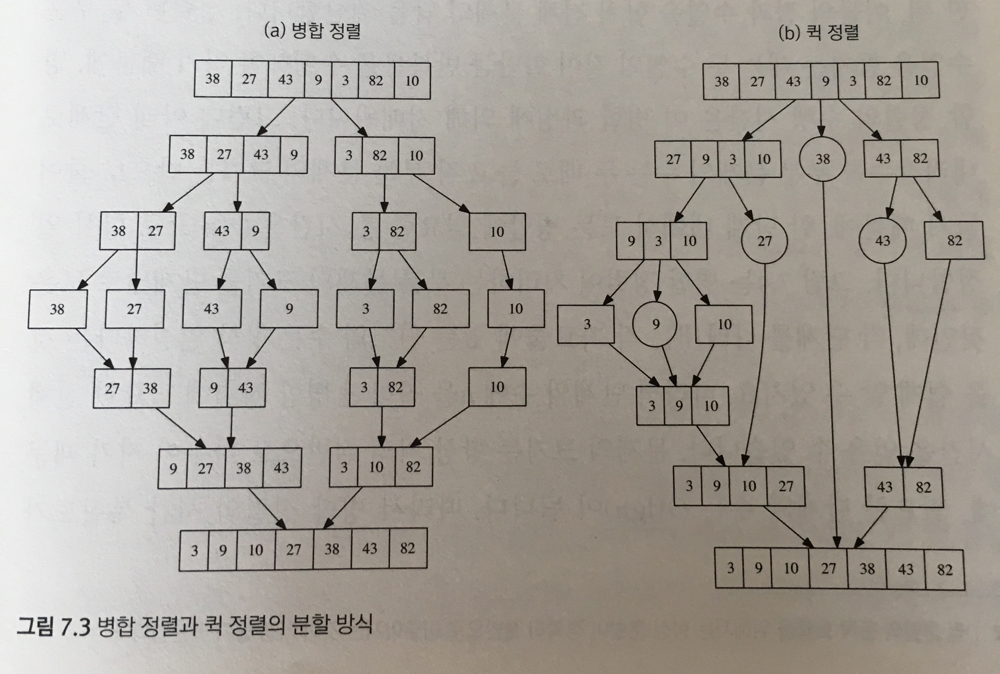
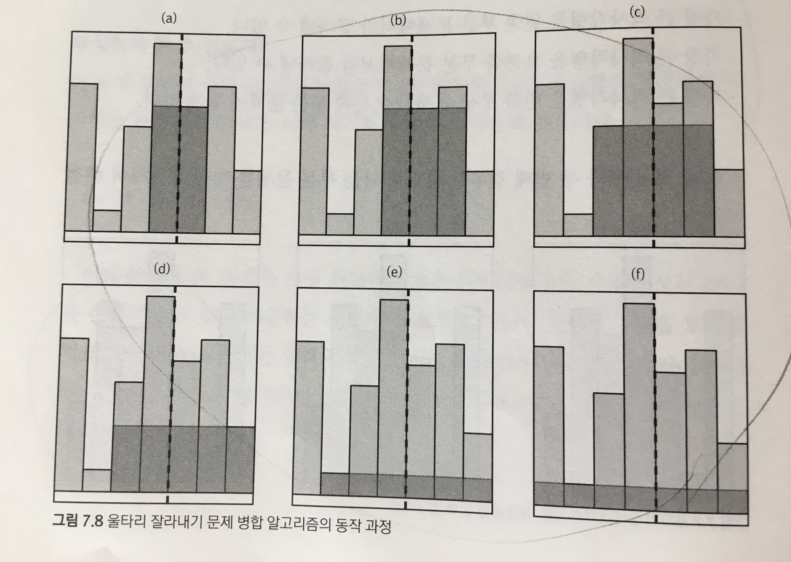

# 7장. 분할 정복
## 7.1 도입

* Divide & Conquer : 각개격파, 분할정복

  

* 재귀호출과 차이: 하나와 나머지로 나누는가?  vs  절반씩 나누는가?



* 분할정복의 구성요소

  * divide : 작은 문제로 분할하는 과정
  * merge : 작은 문제의 답을 병합하여 큰 문제의 답으로 만드는 과정
  * base case : 분할하지 않고 바로 답할 수 있는 기본문제

  

* 수열의 합
  
  * 시간복잡도 : O(log<sub>2</sub>n) -> 책 178page 참조
  
  ```C++
  long recursiveSum(long n) {
      if (n==1) return 1;
      return n + recursiveSum(n-1);
  }
  
  long fastSum(long n) {
      if (n==1) return 1;
      
      if (n%2==1) return fastSum(n-1) + n;
      else return 2 * fastSum(n/2) + n*n/4;
  }
  ```
  


* 행렬의 거듭제곱
  
  * A<sup>m</sup> = A<sup>m/2</sup> X A<sup>m/2</sup> 
  
  ```c++
  SquareMatrix pow(const SquareMatrix& A, int m) {
      if (m==0) return identity(A.size());
      
      if (m%2>0) return pow(A, m-1) * A;
      else return pow(A, m/2) * pow(A, m/2);
  }
  ```
  
  
  
* 행렬의 곱 분할 방식의 비교
  
  * 중복계산되어 낭비가 심하다. -> overlapping subproblems.
  * 동적계획법이 고안된 계기 (8장에서 다룸)
  
  
  
  
  
* 병합 정렬과 퀵정렬
  
  
  
  * 병합정렬은 일단 작게 나누고 병합하면서 정렬
  * 퀵정렬은 나눌 때 정렬하고 병합은 간단하게.
  * 시간복잡도
    * 병합정렬 : O(nlog<sub>2</sub>n)
    * 퀵정렬 : O(nlog<sub>2</sub>n) 이지만, 최악의 경우는 O ( n<sup>2</sup> )


- 카라츠바(karatsuba)의 곱셈 알고리즘

  - 일단 일반 곱셈부터...

  ```c++
  void normalize(vector<int>& a) {
      for (int i = 0; i+1 < (int)a.size(); i++) {
          if (a[i]<0) {
              int borrow = (abs(a[i]) + 9) / 10;
              a[i+1] -= borrow;
              a[i] += borrow * 10;
          }
          else {
              a[i + 1] += a[i] / 10;
              a[i] = a[i] % 10;
          }
      }
      while (a.size()>0 && a.back()==0) {
          a.pop_back();
      }
  }
  
  vector<int> mul(const vector<int>& a, const vector<int>& b) {
      vector<int> c(a.size() + b.size() + 1, 0);
      for (int i = 0; i < (int)a.size(); i++) {
          for (int j = 0; j < (int)b.size(); j++) {
              c[i + j] += a[i] * b[j];
          }
      }
      normalize(c);
      return c;
  }
  ```

  

  - 카라츠바 알고리즘의 핵심은...

    - 큰 수의 곱셈 한 번을 작은 수의 곱셈 네 번으로 만들고

    - 그 곱셈 네 번을 세 번으로 줄인 것!

    - 시간복잡도는 O(n<sup>log<sub>2</sub>3</sup>)

      

    - 카라츠바 곱셈 코드

      ```c++
      // a += b * 10^k;
      void addTo(vector<int>& a, vector<int>& b, int k) {
          a.resize(max(a.size(), b.size() + k));
          for (int i = 0; i < b.size(); i++) a[i + k] += b[i];
      }
      
      // a -= b;
      void subFrom(vector<int>& a, vector<int>& b) {
          a.resize(max(a.size(), b.size()) + 1);
          for (int i = 0; i < b.size(); i++) a[i] -= b[i];
      }
      
      vector<int> karatsuba(vector<int>& a, vector<int>& b) {
          if (a.size()<b.size()) karatsuba(b, a);
          if (a.size()==0 || b.size()==0) return vector<int>();
          if (a.size()<=50) return mul(a, b);
      
          vector<int> a0(a.begin(), a.begin() + a.size()/2);
          vector<int> a1(a.begin() + a.size()/2, a.end());
          vector<int> b0(b.begin(), b.begin() + (int)b.size()/2);
          vector<int> b1(b.begin() + (int)b.size()/2, b.end());
      
          vector<int> z2 = karatsuba(a1, b1);
          vector<int> z0 = karatsuba(a0, b0);
      
          addTo(a0, a1, 0);
          addTo(b0, b1, 0);
          vector<int> z1 = karatsuba(a0, b0);
          subFrom(z1, z0);
          subFrom(z1, z2);
      
          vector<int> c;
          addTo(c, z0, 0);
          addTo(c, z1, (int)a.size()/2);
          addTo(c, z2, (int)a.size()/2 + (int)a.size()/2);
      
          normalize(c);
      
          return c;
      }
      ```

      

## 7.2 QUADTREE (쿼드트리 뒤집기)

- QuadTree구조 파악하기
  - 해당구역에 뭔가 다른 색이 있으면 네 구역으로 나누어서 w,b를 네 개 표시하고 앞에 x를 붙인다.
  - 이것을 재귀적으로 반복한다.
  - 분석
    - Divide : upper left, upper right, bottom left, bottom righ 네 개로 나누어서 뒤집기 반복.
    - Merge : 네 개를 뒤집어서 합치기. 뒤집는 작업은 upper를 뒤로 보내고, bottom을 앞으로 보내면된다.
    - base case : 모두 같은 색. b 또는 w.


```c++
string rev(string::iterator& it) {
	char head = *it;
	++it;//next character

	if (head == 'b' || head == 'w') return string(1, head);
	
	//if head==x
	string ul = rev(it);
	string ur = rev(it);
	string bl = rev(it);
	string br = rev(it);

	//return string("x") + ul + ur + bl + br;//원본 그대로 조합
	return string("x") + bl + br + ul + ur;//상하 뒤집기
}
```


## 7.4 FENCE (울타리 잘라내기)

- 분할정복으로 풀어보기
  - 일단 좌, 우 두 구역으로 나누면 아래 세 경우가 나온다.
    - 답이 좌측 영역에 있다.
    - 답이 우측에 있다.
    - 답이 중앙에 걸쳐 있다.
  - 이 접근 방법은 4.6절의 코드4.10의 (책 118페이지) 문제와 같다.
  - 아래 그림은 중앙에 걸쳐있는 경우 좌측으로 먼저 갈지 우측으로 먼저 갈지 결정하는 과정을 보여준다.
    - 아래와 같은 방법으로 좌, 우로 확장하면서 나오는 경우를 모두 검사하여 최대 면적을 찾는다.
    - 아래 표시된 진한 영역 넓이중 가장 큰 것이 중앙에 걸쳐있는 경우의 최대 면적이다.



- 코드

* ```c++
  int maxFence(vector<int>& h, int left, int right) {
      if (left==right) {
          return h[left];//base case
      }
      
      int mid = (right + left) / 2;
      
      //왼쪽 또는 오른쪽에만 있을 경우
      int leftMax = maxFence(h, left, mid);
      int rightMax = maxFence(h, mid + 1, right);
      
      //중앙에 걸쳐 있을 경우
      int lo = mid;
      int hi = mid + 1;
      int height = min(h[lo], h[hi]);
      int middleMax = height * 2;//판자 두 개는 항상 가지고 있어야한다.
      
      while (left<=lo && hi<=right) {
          if (lo==left && hi==right) {//양끝까지 도달
              break;
          }
          else if (lo==left) {//왼쪽끝은 이미 도달, 오른쪽으로만 가야한다.
              hi++;
              height = min(height, h[hi]);
          }
          else if (hi==right) {//오른쪽끝은 이미 도달, 왼쪽으로만...
              lo--;
              height = min(height, h[lo]);
          }
          else {
              if (h[lo-1]<h[hi+1]) {//더 높은 판자가 있는 쪽으로...
                  hi++;
                  height = min(height, h[hi]);
              }
              else {
                  lo--;
                  height = min(height, h[lo]);
              }
          }
  
          middleMax = max(middleMax, height * (hi-lo+1));
      }
      
      return max(max(leftMax, rightMax), middleMax);
  }
  ```
  
  
  

## 7.3 FANMEETING(팬미팅)

### 문제

* 가나다라마
* 
