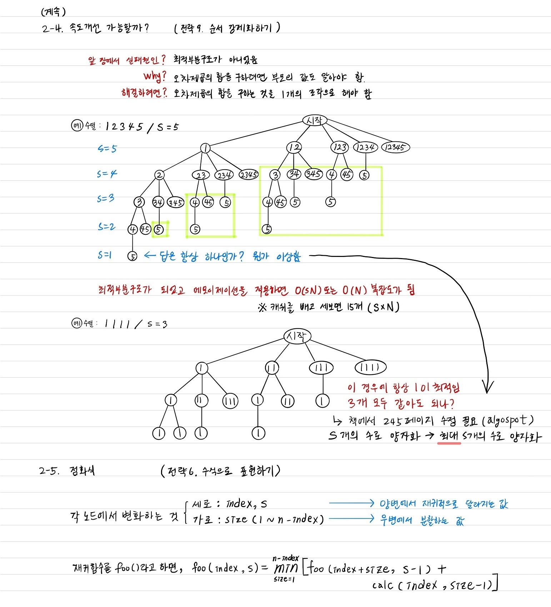

## 8.7~8.8 원주율 외우기 (문제 ID: PI, 난이도: 하)
#### 해결과정
  
  
  
#### 소스코드
  ```
  #include <iostream>
  #include <cstring>

  using namespace std;

  const int INF = 987654321;
  string N = "12673939";

  int classify(int a, int b) {
    string M = N.substr(a, b-a+1);

    if(M == string(M.size(), M[0]))
      return 1;

    bool progressive = true;
    for(int i = 0; i < M.size(); ++i)
      if(M[i+1] - M[i] != M[i] - M[0])
        progressive = false;

    if(progressive && abs(M[1] - M[0]) == 1)
      return 2;

    bool alternating = true;
    for(int i = 0; i < M.size(); ++i)
      if(M[i] != M[i%2])
        alternating = false;
    if(alternating) return 4;
    if(progressive) return 5;
    return 10;
  }

  int cache[10002];
  int memorize(int begin) {
    if(begin == N.size())
      return 0;

    int& ret = cache[begin];
    if(ret != -1)
      return ret;
    ret = INF;
    
    for(int L = 3; L <= 5; ++L)
      if(begin + L <= N.size())
        ret = min(ret, memorize(begin + L) + classify(begin, begin + L -1));

    return ret;
  }

  int main() {
      memset(cache, -1, sizeof(int)*10002);
      cout << memorize(0) << endl;

      return 0;
  }
  ```
## 8.9~8.10 Quantization (문제 ID: QUANTIZE, 난이도: 중)
#### 해결과정
    
    
    
#### 소스코드
  ```c++
  #include <iostream>
  #include <algorithm>
  #include <cstring>

  using namespace::std;

  const int INF = 987654321;

  int n = 9;
  int A[9] = { 1, 744, 755, 4, 897, 902, 890, 6, 777 };
  int pSum[9], pSqSum[9];

  void precalc() {
    sort(A, A + n);
    pSum[0] = A[0];
    pSqSum[0] = A[0] * A[0];

    for (int i = 1; i < n; ++i) {
      pSum[i] = pSum[i - 1] + A[i];
      pSqSum[i] = pSqSum[i - 1] + A[i] * A[i];
    }
  }

  int minError(int lo, int hi) {
    int sum = pSum[hi] - (lo == 0 ? 0 : pSum[lo - 1]);
    int sqSum = pSqSum[hi] - (lo == 0 ? 0 : pSqSum[lo - 1]);

    int m = int(0.5 + (double)sum / (hi - lo + 1));

    int ret = sqSum - 2 * m * sum + m * m * (hi - lo + 1);
  return ret;
  }

  int cache[9][9];

  int quantize(int from, int parts) {
    if (from == n)
      return 0;

    if (parts == 0)
      return INF;

    int& ret = cache[from][parts];

    if (ret != -1)
      return ret;

    ret = INF;

    for (int partSize = 1; from + partSize <= n; ++partSize)
      ret = min(ret, minError(from, from + partSize - 1) + quantize(from + partSize, parts - 1));

    return ret;
  }

  int main() {
      precalc();
      memset(cache, -1, sizeof(int)*9*11);

      std::cout << quantize(0, 3) << std::endl;
  }
  ```
## 8.11 경우의 수와 확률
### 예제: 타일링 방법의 수 세기 (문제 ID: TILING2, 난이도: 하)
#### 해결과정
    
    
#### 소스코드  
  ```
#include <iostream>
#include <cstring>

using namespace::std;

const int MOD = 1000000007;
int cache[6];

int tiling(int width) {
  if(width <= 1) 
    return 1;

  int& ret = cache[width];
  if(ret != -1)
    return ret;

  return ret = (tiling(width-2) + tiling(width-1)) % MOD;
}

int main() {
  memset(cache, -1, sizeof(int)*6);

  std::cout << tiling(5) << std::endl;
}
  ```
### 예제: 삼각형 위의 최대 경로 개수 세기 (문제 ID: TRIPATHCNT, 난이도: 중)
#### 해결과정
    
#### 소스코드
  ```
  #include <iostream>
  #include <cstring>
  using namespace::std;
  
  int n=4, triangle[4][4] = {{9,0,0,0}, {5,7,0,0}, {1,3,2,0}, {3,5,5,6}};
  int cache[4][4];
  int countCache[4][4];

  int path2(int y, int x) {
    if(y == n-1)
      return triangle[y][x];

    int& ret = cache[y][x];
    if(ret != -1)
      return ret;

    return ret = max(path2(y+1, x), path2(y+1, x+1)) + triangle[y][x];
  }
  
  int count(int y, int x) {
    if(y == n-1)
      return 1;

    int& ret = countCache[y][x];
    if(ret != -1)
      return ret;

    ret = 0;
    if(path2(y+1, x+1) >= path2(y+1, x))
      ret += count(y+1, x+1);

    if(path2(y+1, x+1) <= path2(y+1, x))
      ret += count(y+1, x);

    return ret;
  }

  int main() {
    memset(cache, -1, sizeof(int)*4*4);
    memset(countCache, -1, sizeof(int)*4*4);

    std::cout << count(0,0) << std::endl;
  }
  ```
