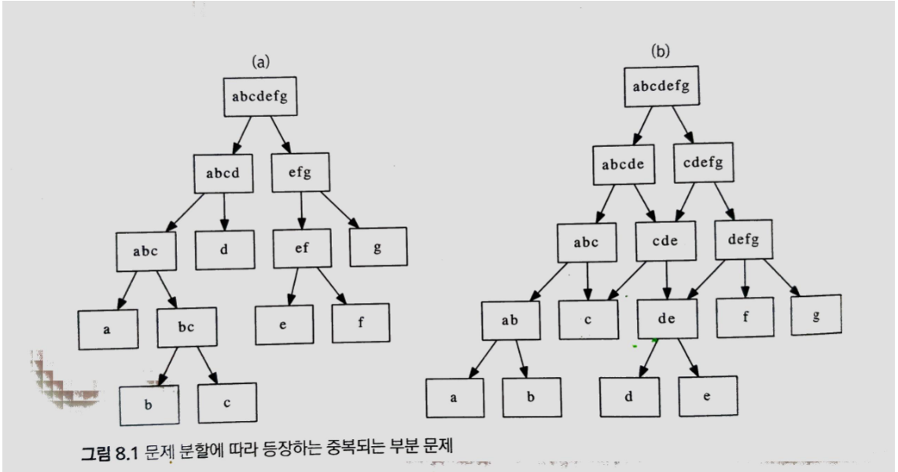

# 8장. 동적 계획법

## 8.1 도입

* 동적 계획법 = 분할 정복과 같은 접근 방식

이유 : 처음 주어진 문제를 더 작은 문제들로 나눈 뒤 각 조각의 답을 계산하고, 이 답들로부터 원래 문제에 대한 답을 계산
차이 : 문제의 답을 여러 번 계산하는 대신 한 번만 계산하고 계산 결과를 재활용함으로서 속도의 향상을 꾀함

메모리의 장소를 캐시라고 부르며, 두번 이상 계산되는 부분 문제를 중복되는 부분 문제(overlapping Subproblem)


* * *



* (a) 각 문제들이 연관이 없기 때문에, 단순하게 재귀 호출을 통해 문제를 분할해도 한 부분 문제를 한번만 해결
* (b) 나눠진 각 문제들이 같은 부분 문제에 의존 => **중복 계산이 많아짐.**
예를 들어 cde는 abcde 해결 할 때와 cdefg를 해결할 때 한 번씩 계산해야 하고, 그러면 cde가 의존하는 c,de는 각각 세번씩

* 대표적인 예
이항 계수 n개의 서로 다른 원소 중에서 r개의 원소를 순서 없이 골라내는 방법의 수


### 외발 뛰기 문제

```c

int n;
int cache[100][100];
int jump[100][100];
 
int jumpgame(int y, int x) {
    if (y == n - 1 && x == n - 1)return 1; //끝에 도착하면 1 출력
    if (y >= n || x >= n)return 0; // 범위 벗어나면 0 출력
    int &ret = cache[y][x];
    if (ret != -1)return ret;
    int jumpsize = jump[y][x];
    return ret = (jumpgame(y + jumpsize, x) || jumpgame(y, x + jumpsize));
}
int main() {
    int cases;
    scanf("%d",&cases);
    int ret[50];
 
    for (int i = 0; i < cases; i++) {
        memset(cache, -1, sizeof(cache));
        scanf("%d",&n);
        for (int j = 0; j < n; j++) {
            for (int k = 0; k < n; k++) {
                scanf("%d",&jump[j][k]);
            }
        }
        ret[i]=jumpgame(0, 0);
    }
 
    for (int i = 0; i < cases; i++) {
        if (ret[i] == 1) cout << "YES" << endl;
        else cout << "NO" << endl;
    }
    return 0;
}

```
