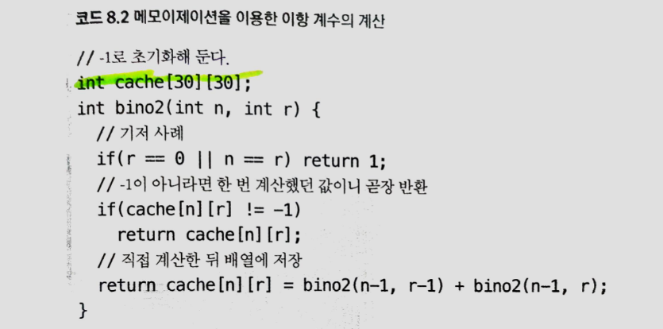
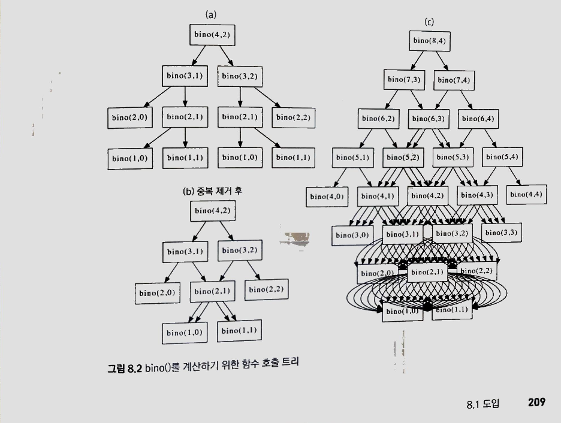
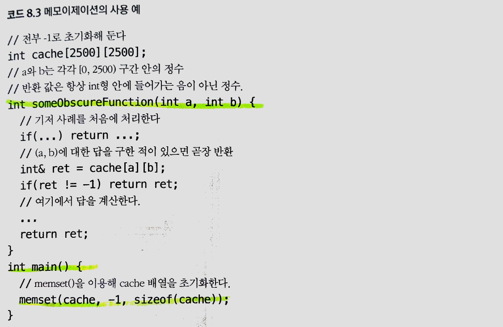
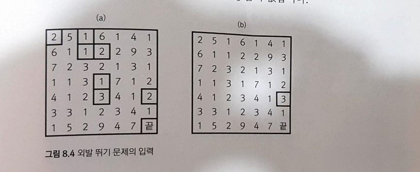
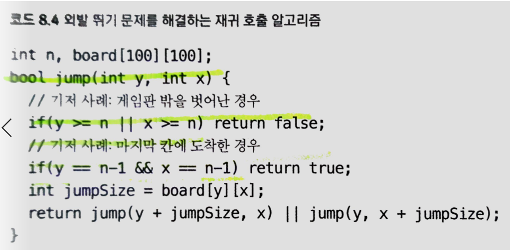

# 8장. 동적 계획법

## 8.1 도입

* 동적 계획법 = 분할 정복과 같은 접근 방식

이유 : 처음 주어진 문제를 더 작은 문제들로 나눈 뒤 각 조각의 답을 계산하고, 이 답들로부터 원래 문제에 대한 답을 계산
차이 : 문제의 답을 여러 번 계산하는 대신 한 번만 계산하고 계산 결과를 재활용함으로서 속도의 향상을 꾀함

메모리의 장소를 캐시라고 부르며, 두번 이상 계산되는 부분 문제를 중복되는 부분 문제(overlapping Subproblem)



* * *


* (a) 각 문제들이 연관이 없기 때문에, 단순하게 재귀 호출을 통해 문제를 분할해도 한 부분 문제를 한번만 해결
* (b) 나눠진 각 문제들이 같은 부분 문제에 의존 => **중복 계산이 많아짐.**
예를 들어 cde는 abcde 해결 할 때와 cdefg를 해결할 때 한 번씩 계산해야 하고, 그러면 cde가 의존하는 c,de는 각각 세번씩

* 대표적인 예
이항 계수 => n개의 서로 다른 원소 중에서 r개의 원소를 순서 없이 골라내는 방법의 수


* * *

* * *

* * *

### 메모이제이션 구현 패턴

1. 항상 기저 사례를 제일 먼저 처리.
   입력이 범위를 벗어난 경우 등을 기저 사례로 처리해야함.(기저 사례를 확인하지 않고 Cache[]에 접근하면 범위를 벗어나는 오류 발생 가능)
   
2. 함수의 반환 값이 항상 0 이상이라는 점을 이용해 Cache[]를 모두 -1로 초기화
   Cache[]의 해당 위치에 적혀 있는 값이 -1 이라면 이 값은 계산 된 반환 값일리 없음.
   
3. ret가 cache[a][b]에 대한 참조형(reference)이라는 데 유의
   ret값을 바꾸면 cache[a][b]의 값도 바뀌기 때문에 귀찮게 매번 cache[a][b]를 쓸 필요가 없음. 인덱스 순서를 바꿔 쓴다거나 하는 실수를 없애줌.
   
4. Memset()을 이용하여 cache 초기화 가능.
* * *

* * *

* * *
### 외발 뛰기 문제(난이도 : 하)

* nXn크기의 격자에 1부터9까지의 정수를 쓴 게임판이 있습니다. 이때 게임의 목적은 게임판의 왼쪽 위 칸에서 시작해서 게임판의 맨 오른쪽 아래 칸에 도착하는 것입니다. 이때 각 칸에 적혀 있는 숫자만큼 아래쪽이나 오른쪽으로 이동할 수 있으며, 중간에 게임판 밖으로 벗어나면 안됩니다. 문제는 게임판이 주어질 때 시작점에서 끝점으로 도달하는 방법이 존재하는 지를 확인하는 것입니다.

* * *

* * *


```c

int n;
int cache[100][100];
int jump[100][100];
 
int jumpgame(int y, int x) {
    if (y == n - 1 && x == n - 1)return 1; //끝에 도착하면 1 출력
    if (y >= n || x >= n)return 0; // 범위 벗어나면 0 출력
    int &ret = cache[y][x];
    if (ret != -1)return ret;
    int jumpsize = jump[y][x];
    return ret = (jumpgame(y + jumpsize, x) || jumpgame(y, x + jumpsize));
}
int main() {
    int cases;
    scanf("%d",&cases);
    int ret[50];
 
    for (int i = 0; i < cases; i++) {
        memset(cache, -1, sizeof(cache));
        scanf("%d",&n);
        for (int j = 0; j < n; j++) {
            for (int k = 0; k < n; k++) {
                scanf("%d",&jump[j][k]);
            }
        }
        ret[i]=jumpgame(0, 0);
    }
 
    for (int i = 0; i < cases; i++) {
        if (ret[i] == 1) cout << "YES" << endl;
        else cout << "NO" << endl;
    }
    return 0;
}

```
